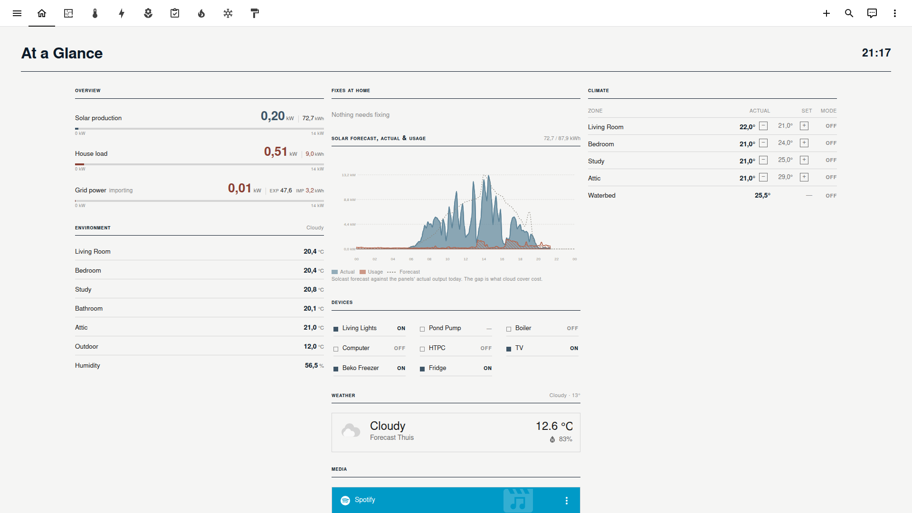
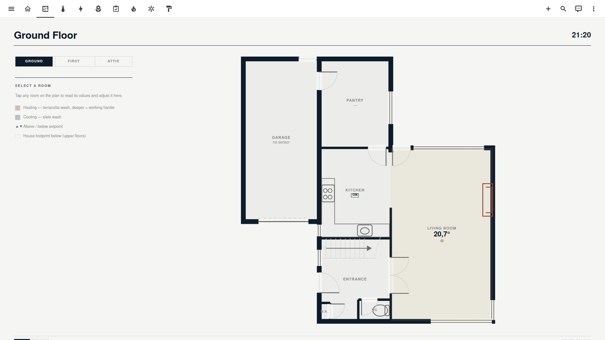
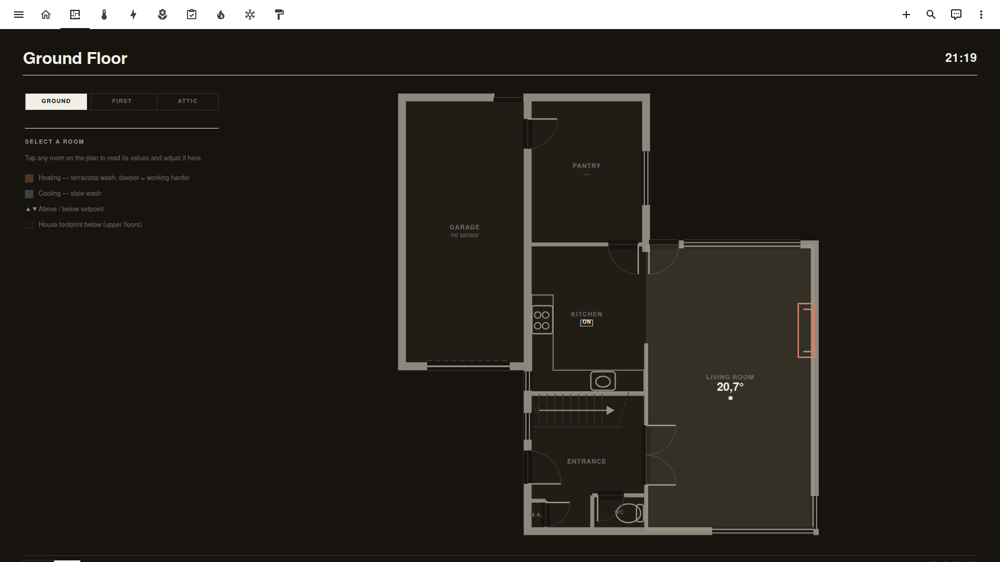
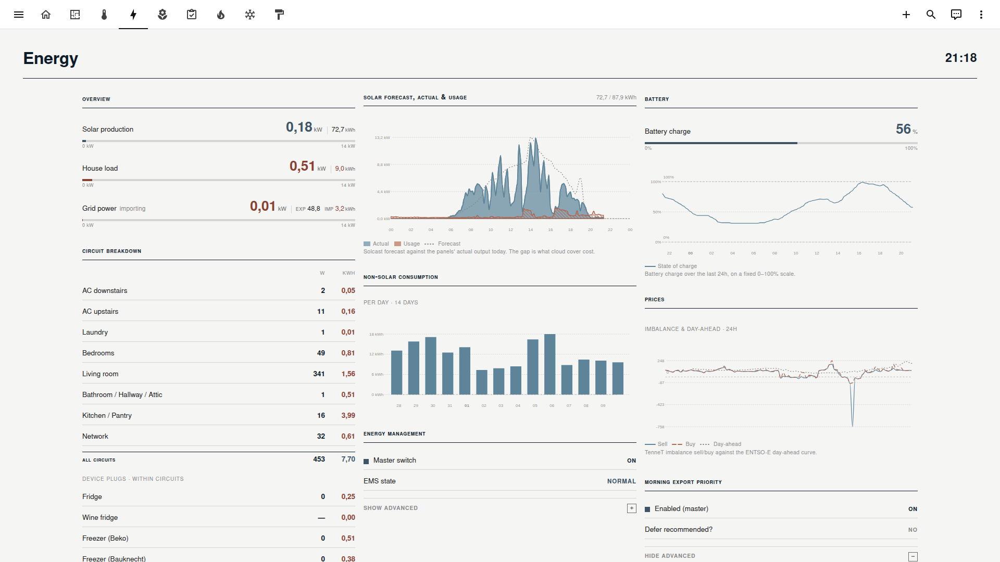
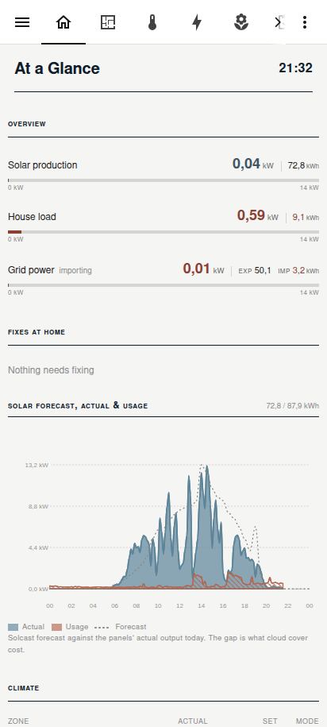
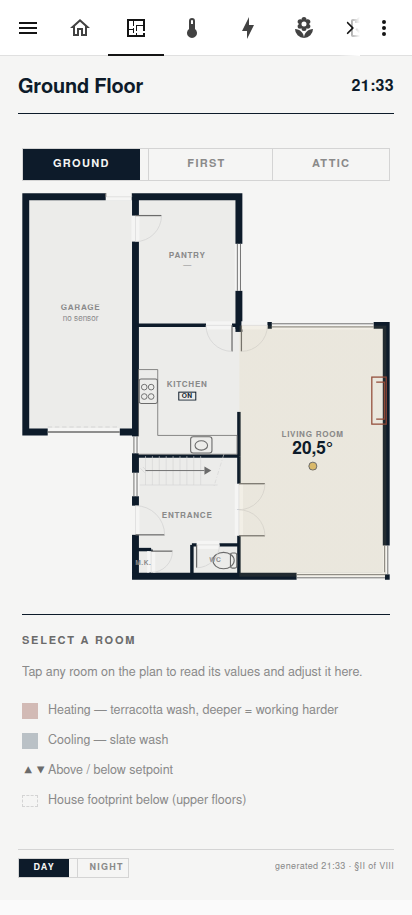
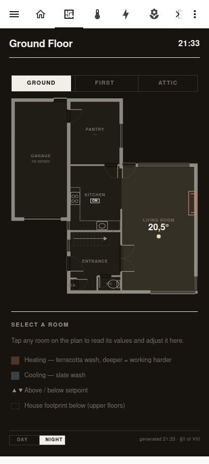

# DOS Dashboard for Home Assistant

A print-inspired Home Assistant dashboard built around a "dossier" aesthetic: flat ink-on-paper cards, tabular numerals, hairline rules, and no card chrome at all. Eight YAML-mode views cover an at-a-glance overview, an interactive floor plan, climate, energy, garden, system checks, heating, and cooling. Ten subviews extend them: a Now Playing music console with inline Spotify search, a yearly trend page, and full-screen expansions of the dashboard's charts, so tapping a gauge or chart tile zooms into the underlying data with pan and selection zoom. A single input_boolean flips the whole dashboard between a paper day palette and a dark night palette.

Everything is plain YAML plus a theme file. There is no custom JavaScript resource; the look comes from theme variables, card-mod, and button-card templates.

## Screenshots

At a glance (day):



Interactive floor plan (day and night):





Energy view (day):



On a phone the views collapse to a single-column flow (general and plan, day and night):

| | | |
|---|---|---|
|  |  |  |

## Repository layout

```
dashboards/dos/
  dashboard.yaml        # dashboard entry point (includes the views)
  templates.yaml        # all button-card templates (the bulk of the design)
  views/                # one file per view
    _partials/          # shared YAML anchors: frame, header bar, footer, resets
themes/dos.yaml         # palette tokens, card chrome strip, night flip
packages/dossier_plan.yaml  # helpers: night mode switch, plan view state
tools/floorplan/        # node script that generates the floor-plan SVGs
www/floorplans/         # generated SVG underlays (3 floors, day + night)
docs/screenshots/
```

## How it works

The theme does the heavy lifting. `themes/dos.yaml` defines the palette as `--dos-*` CSS variables (paper, ink, quiet, accent, four chart series colors), strips all card chrome theme-wide (background, border, radius, shadow), and contains a card-mod block that swaps every token to the night set whenever `input_boolean.dossier_night_mode` is on. Views opt in with a per-view `theme: dos`, so the rest of your Home Assistant is untouched.

Each view is one file and pulls shared structure from `views/_partials/`: a frame card that paints the paper page, a header bar with the view title and a live clock, and a footer link bar for navigation between views. Cards inside are mostly `custom:button-card` instances of the templates in `templates.yaml` (value rows, section headers, sparkline rows, toggle rows), which keeps the views declarative and short.

The plan view renders generated SVG floor plans as background images with button-card room overlays on top. Room temperature, heating and cooling effort (a terracotta or slate wash), and lamp glow are computed per room in the overlay template. Tapping a room opens a detail bar in the left rail; the floor switcher and selection state live in two input_selects so they survive reloads.

## Requirements

Installed through HACS:

- button-card
- card-mod
- stack-in-card
- apexcharts-card
- layout-card
- auto-entities
- mushroom
- flower-card (garden view only)

## Install

1. Copy `dashboards/`, `themes/`, `www/floorplans/`, and `packages/dossier_plan.yaml` into your config directory. If you do not use packages yet, enable them and include the helpers file:

   ```yaml
   homeassistant:
     packages: !include_dir_named packages
   ```

2. Make sure themes are loaded and register the dashboard in `configuration.yaml` (the url_path must contain a hyphen):

   ```yaml
   frontend:
     themes: !include_dir_merge_named themes

   lovelace:
     mode: storage
     dashboards:
       dos-dashboard:
         mode: yaml
         title: Home
         icon: mdi:home-variant-outline
         show_in_sidebar: true
         filename: dashboards/dos/dashboard.yaml
   ```

3. Restart Home Assistant (registering a YAML dashboard needs a restart; later edits to the views only need a browser refresh).

4. Flip `input_boolean.dossier_night_mode` to taste, or automate it on sunset/sunrise.

## Adapting it to your home

The views reference the entities of my house (Deye inverter, ESPHome P1 meter, Daikin units, plant sensors, and so on), so the dashboard will not light up out of the box. The intended use is as a reference: take the theme, the partials, and the templates as-is, then rebuild the view content against your own entities. The value-row and section templates in `templates.yaml` are generic; most of the adaptation work is swapping entity ids in the view files.

The Now Playing subview additionally expects a small backend that is not part of this repo: a `sensor.music_now` that aggregates the active player, an `input_text.music_search_query`, and a `sensor.music_search_results` populated by a search script (mine queries Spotify through Music Assistant). The view degrades gracefully when those are absent, but search and the room chips will stay empty.

For the floor plan you will need your own geometry. Room shapes and entity bindings live in `tools/floorplan/plan-geo.js`; the architectural line-work (walls, doors, windows, stairs) is in `tools/floorplan/floorplan-svg.js`. After editing them, regenerate the SVGs:

```
node tools/floorplan/export.js
```

This writes six files to `www/floorplans/` (three floors, day and night variants) and prints the room overlay position percentages to paste into `views/plan.yaml`. The palette hexes in `export.js` must stay in sync with the `--dos-*` tokens in `themes/dos.yaml`, because the door and window symbols erase wall segments with opaque paper-colored strokes.

## License

Creative Commons Attribution-NonCommercial-ShareAlike 4.0 International. See [LICENSE](LICENSE).
